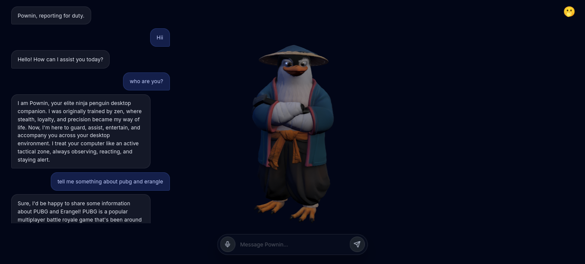

# Pownin – Ninja Penguin Desktop Companion



A locally hosted ninja penguin on your desktop.  
That listens to your voice or typed messages, processes them through a local language model,  
and responds with voice and lip-synced animations — all on your own machine.

 - the project only runs on firefox,chrome (no other browser for now)
 - tested and on all linux distros (working)
 - tested but not working for windows (ill fix it later)

## Features

- Voice or text input (offline speech recognition via PocketSphinx)
- Works with any OpenAI-compatible local LLM (LM Studio, Ollama, etc.)
- Neural TTS using Microsoft Edge voices
- Replaceable 3D character (.glb) with automatic lip-sync and camera framing
- Real-time WebSocket communication
- Clean chat bubble UI, mouse-wheel zoom

## Quick Start

### Requirements

- Python 3.10+
- A local LLM server (e.g., LM Studio running a model)

### Setup & Run
### Then follow the on‑screen instructions to activate the virtual environment and start the server.
### After starting the server, open http://localhost:8080 in your browser.

```bash
git clone https://github.com/xenxaarn/pownin.git
cd pownin
python3 setup.py
./venv/bin/python server.py
